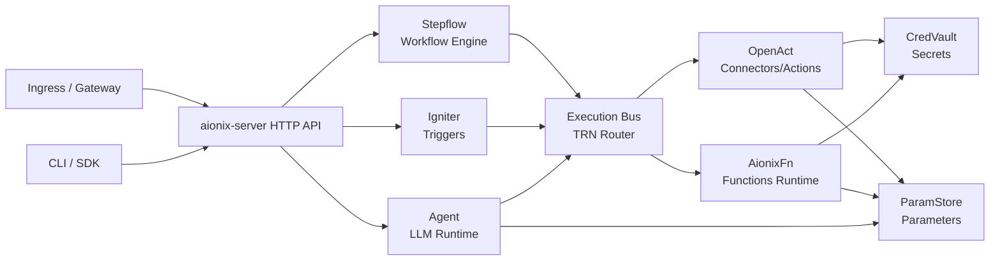

# AionixOne Releases

Official community binary releases for AionixOne (single-binary aio).

## What is AionixOne

AionixOne is a local-first automation platform that bundles workflow
orchestration (Stepflow), action execution (OpenAct), serverless functions
(AionixFn), and an agent runtime behind one CLI and one server. It can be used
as an agent builder by packaging tools, skills, and execution flows into
reusable, easy-to-distribute bundles.



Agent resolves tools and parameters via the execution bus and resolvers, not by
directly reading storage.

## Quick Install

### macOS (Apple Silicon)

```bash
curl -fsSL https://raw.githubusercontent.com/aionix-labs/aionixone-releases/main/install.sh | bash
```

The installer places `aio` in `~/.local/bin` and adds it to your PATH in
`~/.zshrc` / `~/.bashrc` when missing. Open a new terminal after install.

Or manually:

```bash
VERSION="community-v0.1.2"
curl -LO "https://github.com/aionix-labs/aionixone-releases/releases/download/${VERSION}/aio-community-darwin-arm64.tar.gz"
tar -xzf aio-community-darwin-arm64.tar.gz
chmod +x aio

# Optional: put aio on PATH (no sudo)
mkdir -p ~/.local/bin
mv ./aio ~/.local/bin/aio
export PATH="$HOME/.local/bin:$PATH"
```

### Linux (x86_64)

```bash
VERSION="community-v0.1.2"
curl -LO "https://github.com/aionix-labs/aionixone-releases/releases/download/${VERSION}/aio-community-linux-x86_64.tar.gz"
tar -xzf aio-community-linux-x86_64.tar.gz
chmod +x aio

# Optional: put aio on PATH (no sudo)
mkdir -p ~/.local/bin
mv ./aio ~/.local/bin/aio
export PATH="$HOME/.local/bin:$PATH"
```

## Usage

After installation:

```bash
aio --help
```

If `aio` is not found:

```bash
export PATH="$HOME/.local/bin:$PATH"
```

## Agent Sessions (Multi-turn + Logs)

Use `--thread-mode create` to start a multi-turn session and `--thread-mode resume`
with the returned `thread_id` to continue it.

```bash
# Start a thread and get thread_id
aio agent chat \
  --model gpt-4o-mini \
  --message "hello" \
  --thread-mode create

# Resume the same thread
aio agent chat \
  --model gpt-4o-mini \
  --message "follow up" \
  --thread-mode resume \
  --thread-id "<thread_id>"
```

When `AIONIX_AGENT_SESSION_STORE=jsonl` (default in `scripts/start.sh`), logs are
written to:

```
~/.aionixone/data/agent-session/<tenant>/<thread_id>.jsonl
```

## Install Location

Default install paths (override via env vars):

- Binary: `~/.local/bin/aio` (`AIONIX_INSTALL_BIN_DIR`)
- Data: `~/.aionixone/data` (`AIONIX_DATA_DIR`)
 - Agent sessions (jsonl): `~/.aionixone/data/agent-session` (`AIONIX_AGENT_SESSION_DIR`)

## Start the server

```bash
# Bootstrap admin API key (run once)
aio server --bootstrap-admin admin --db-mode sqlite --data-path "$HOME/.aionixone/data" --port 53000

# Start server
AIONIX_API_KEY="<key>" \
aio server --db-mode sqlite --data-path "$HOME/.aionixone/data" --port 53000

# Verify
AIONIX_API_BASE="http://127.0.0.1:53000" \
AIONIX_API_KEY="<key>" \
aio status
```

## Server

- **URL**: http://localhost:53000
- **Health Check**: http://localhost:53000/health (process liveness)
- **Readiness**: http://localhost:53000/ready (dependency readiness)

## Optional helper scripts

If you cloned this repo, the helper scripts under `scripts/` work with the
community single-binary and store state in `~/.aionixone`:

```bash
./scripts/setup.sh
./scripts/start.sh
./scripts/status.sh
./scripts/stop.sh
```

## Community Edition Limits

This is the free Community Edition:

| Resource | Limit |
|----------|-------|
| Agent profiles | 3 |
| Toolsets | 3 |
| Workflows | 2 |
| Triggers | 5 |
| Ingress routes | 2 |
| OpenAct actions | 20 |
| OpenAct connections | 5 |
| Functions | 10 |
| Tenants | 1 |
| Distributed runners | Disabled |

See full details in [COMMUNITY_LIMITS.md](COMMUNITY_LIMITS.md).

Community is intended for local exploration and demos. You can run multiple
instances if needed.

## Examples

Community-friendly examples are included in `examples/` (the distributed
scenarios are intentionally excluded for the single-binary edition).

```
examples/
  common/
  scenarios/
  scripts/
```

ActionHub packages used by examples live under `actionhub/`:

```
actionhub/
  openai/
  function-samples/
```

## ActionHub

ActionHub is the packaging format for reusable integrations: connections,
actions, tools, skills, and function bundles that can be installed into your
local AionixOne server. It is how examples ship OpenAI tools or sample
functions without manual setup.

Key concepts:

- Package: a directory with `manifest.yaml` plus actions/tools/skills.
- Install: `aio hub install <path>` imports resources into your server.
- Verify: packages can declare a verify action/function to confirm installation.

Basic usage:

```bash
# Install a package from this repo
aio hub install ./actionhub/function-samples --yes

# Install OpenAI tools (requires a CredVault secret)
aio sec create openai/api-key -t apiKey --value '{"apiKey":"<OPENAI_API_KEY>"}'
aio hub install ./actionhub/openai --yes
```

After install, you can run:

```bash
# Invoke a sample function
aio fn invoke hello-python -d '{"name":"ActionHub"}'

# Execute a tool-backed action
aio act execute http/openai/models/list -d '{}'
```

LLM routing requires a model -> action mapping (one-time setup):

```bash
aio agent llm map set gpt-4o-mini \
  --action trn:openact:default:action/http/openai/chat/completions:execute
```

Minimal OpenAI setup (no YAML required):

```bash
aio sec create openai/api-key -t apiKey --value '{"apiKey":"<OPENAI_API_KEY>"}'
aio hub install ./actionhub/openai --yes
aio agent chat --model gpt-4o-mini --message "hello"
```

## Requirements

- macOS 12+ (Apple Silicon) or Linux (x86_64)
- 512MB RAM minimum
- 1GB disk space

## Troubleshooting

### Community license warning

If you see a license warning on startup, it's safe to ignore in Community
Edition.

## Uninstall

```bash
./uninstall.sh
```

Flags:
- `--yes` skip confirmation
- `--keep-data` preserve `~/.aionixone`
- `--remove-path` remove PATH entries from shell rc files

### CLI appears to hang

`aio act execute` reads stdin when `-d` is omitted. If it looks stuck, pass
`-d '{}'` (or pipe input) to send an empty payload.

### macOS Security Warning

If you see "cannot be opened because the developer cannot be verified":

```bash
xattr -d com.apple.quarantine aio
```

### Server won't start

```bash
# Check if port is in use
lsof -i :53000

# Check logs
cat data/server.log
```

### Reset everything

```bash
rm -rf "$HOME/.aionixone"
```

## Links

- [Documentation](https://docs.aionixone.com/)
- [Source Code](https://github.com/aionixone/aionixone-platform) (Private)

## License

AionixOne is proprietary software. See [LICENSE](LICENSE) for details.
